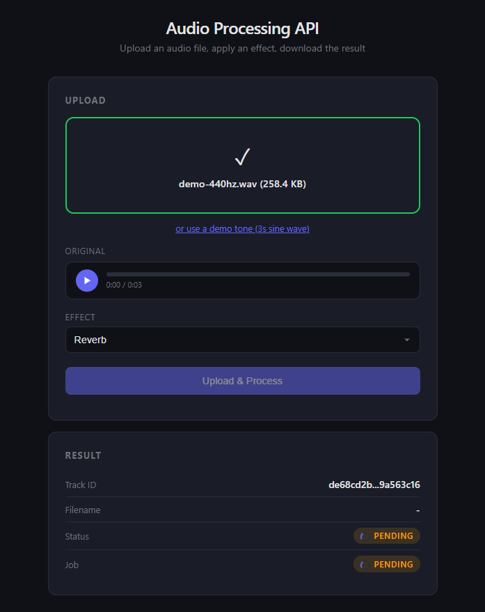

# Audio Processing API

REST API for audio processing with async job execution via message queues.

Upload an audio file, apply an effect (reverb, echo, pitch shift...), and download the processed result.

Built with **Node.js**, **Express**, **MongoDB**, **Redis** and **RabbitMQ**.



## Architecture

Clean Architecture with four layers:

```
presentation/     Controllers, routes, middlewares (auth, error handling)
application/      Use cases, DTOs, application ports
domain/           Entities, value objects, repository ports
infrastructure/   MongoDB, Redis, RabbitMQ, MinIO, Express, ffmpeg, Winston
```

### Request Flow

```
  Upload:   Client ──► multer ──► AudioController ──► UploadAudioUseCase
                                                          │
                                    AudioTrack + ProcessingJob ──► MongoDB
                                                          │
                                              Job message ──► RabbitMQ
                                                                  │
  Worker:                         ProcessJobUseCase ◄── Consumer ◄┘
                                       │
                                  MinIO (download original) → ffmpeg → MinIO (upload processed)
                                       │
                                  MongoDB (READY) + Redis (invalidate)

  Status:   Client ──► AudioController ──► GetAudioStatusUseCase
                                               │
                                         Redis hit? ──► cached DTO
                                         Redis miss? ──► MongoDB ──► cache

  Download: Client ──► AudioController ──► DownloadAudioUseCase ──► MinIO stream
```

**Key patterns:**
- Result/Either monad for error handling (no throw in domain/application)
- Port & Adapter for all infrastructure (repositories, cache, queue, audio processor, file storage)
- Saga compensation for multi-entity consistency in async processing
- API key authentication on protected routes
- TDD with 140+ tests (unit + integration + contract)

Architecture decisions are documented in [`docs/decisions/`](docs/decisions/).

## Endpoints

| Method | Path                       | Auth | Description              | Status |
|--------|----------------------------|------|--------------------------|--------|
| POST   | /api/v1/audio              | Yes  | Upload audio + process   | 202    |
| GET    | /api/v1/audio/:id          | Yes  | Get audio track status   | 200    |
| GET    | /api/v1/audio/:id/download | Yes  | Download processed audio | 200    |
| GET    | /api/v1/health             | No   | Health check             | 200    |

Authentication: send `x-api-key` header. Set `API_KEY` in `.env` to enable (disabled by default in dev).

### POST /api/v1/audio

Multipart form-data:
- `file`: audio file (mp3, wav, ogg, flac, aac, webm — max 50MB)
- `effect`: one of `NORMALIZE`, `REVERB`, `ECHO`, `PITCH_SHIFT`, `NOISE_REDUCTION`

Response `202 Accepted`:
```json
{
  "audioTrackId": "uuid",
  "jobId": "uuid"
}
```

### GET /api/v1/audio/:id

Response `200 OK`:
```json
{
  "audioTrackId": "uuid",
  "filename": "song.mp3",
  "mimeType": "audio/mpeg",
  "sizeInBytes": 1048576,
  "status": "READY",
  "durationSeconds": 243.5,
  "downloadReady": true,
  "createdAt": "2024-01-01T00:00:00.000Z",
  "job": {
    "jobId": "uuid",
    "effect": "REVERB",
    "status": "COMPLETED",
    "startedAt": "2024-01-01T00:01:00.000Z",
    "completedAt": "2024-01-01T00:01:30.000Z"
  }
}
```

### GET /api/v1/audio/:id/download

Returns the processed audio file as a binary stream. Only available when `status` is `READY`.

## Tech Stack

- **Runtime:** Node.js 22 + TypeScript 5
- **HTTP:** Express 4 + Zod validation + Helmet + CORS + rate limiting
- **Database:** MongoDB 7 (Mongoose ODM)
- **Cache:** Redis 7 (ioredis) with TTL strategy (5s in-flight, 5min terminal)
- **Queue:** RabbitMQ 3 (amqplib) with Dead Letter Queue
- **Storage:** MinIO (S3-compatible object storage via minio SDK)
- **Audio:** ffmpeg via fluent-ffmpeg (normalize, reverb, echo, pitch shift, noise reduction)
- **Auth:** API key middleware (x-api-key header)
- **Logging:** Winston (JSON in prod, pretty print in dev)
- **Testing:** Vitest + mongodb-memory-server + Supertest
- **Linting:** ESLint 9 (flat config) + @typescript-eslint
- **Deployment:** Docker Compose + Kubernetes manifests

## Getting Started

### Prerequisites

- Node.js >= 22
- Docker and Docker Compose

### Setup

```bash
# Clone and install
git clone https://github.com/jorgeferrando/audio-api.git
cd audio-api
npm install

# Start full stack
docker compose up

# Open the web UI
open http://localhost:3000
```

The web UI includes a demo tone generator — no audio files needed to test.

### Development (without Docker for API/worker)

```bash
# Start only infrastructure
docker compose up -d mongodb redis rabbitmq minio

# Copy environment variables
cp .env.example .env

# Run the API server (hot reload)
npm run dev

# Run the worker in a separate terminal (hot reload)
npm run dev:worker
```

### Scripts

| Script              | Description                           |
|---------------------|---------------------------------------|
| `npm run dev`       | Start API server (hot reload)         |
| `npm run dev:worker`| Start worker (hot reload)             |
| `npm run build`     | Compile TypeScript                    |
| `npm start`         | Start compiled API server             |
| `npm run start:worker` | Start compiled worker              |
| `npm test`          | Run all tests                         |
| `npm run test:watch`| Run tests in watch mode               |
| `npm run test:coverage` | Run tests with coverage report    |
| `npm run lint`      | Run ESLint                            |
| `npm run type-check`| Run TypeScript type checker           |

## Project Structure

```
src/
  domain/
    audio/          AudioTrack entity, IAudioTrackRepository port
    job/            ProcessingJob entity, IProcessingJobRepository port
  application/
    audio/          UploadAudio, GetAudioStatus, DownloadAudio use cases, DTO
    job/            ProcessJobUseCase, IJobPublisher, IAudioProcessor ports
    storage/        IFileStorage port
  infrastructure/
    audio/          FfmpegAudioProcessor
    cache/          RedisCacheService
    db/             Mongoose models, repositories, connection
    http/           Express app setup, multer config
    logger/         WinstonLogger, ConsoleLogger
    queue/          RabbitMQ publisher, consumer, setup
    storage/        MinioFileStorage
  presentation/
    controllers/    AudioController
    middlewares/    API key auth, error handler
    public/         Web UI (single-page HTML)
    routes/         Audio routes, health routes
  shared/           Result, AppError, ILogger, ICacheService
docs/
  decisions/        Architecture Decision Records (9 ADRs)
k8s/                Kubernetes manifests
tests/
  integration/      MongoDB repository + HTTP integration tests
```

## Kubernetes

The `k8s/` directory contains tested manifests that deploy the full stack (8 pods). Two scripts automate the entire workflow:

```bash
# One-button deploy: build, push, deploy all manifests, wait for pods
bash scripts/k8s-deploy.sh

# One-button production test: health + auth + upload + process + download
bash scripts/k8s-test.sh
```

Both scripts are cross-platform (Windows git bash, Linux, Mac).

**Prerequisites for K8s deploy:**
- Docker running + kubectl configured with a cluster (e.g. Docker Desktop with K8s enabled)
- Logged in to ghcr.io: `echo $(gh auth token) | docker login ghcr.io -u YOUR_USER --password-stdin`
- Requires GitHub token with `write:packages` scope: `gh auth refresh --hostname github.com --scopes write:packages`
- The container package must be **public** for K8s to pull without imagePullSecrets (set at GitHub package settings)

Manual deploy steps if preferred:

```bash
docker build -t ghcr.io/jorgeferrando/audio-api:latest .
docker push ghcr.io/jorgeferrando/audio-api:latest
kubectl apply -f k8s/namespace.yaml
kubectl apply -f k8s/infra.yaml
kubectl apply -f k8s/configmap.yaml -f k8s/secret.yaml
kubectl apply -f k8s/api-deployment.yaml -f k8s/api-service.yaml -f k8s/worker-deployment.yaml
kubectl -n audio-api port-forward svc/audio-api 8080:80
```

API and worker share the same Docker image but are deployed as **separate Deployments** with independent scaling and resource limits:

| Deployment | Replicas | CPU | Memory | Entry point |
|---|---|---|---|---|
| `audio-api` | 2 | 100m - 500m | 128Mi - 512Mi | `src/index.ts` (default CMD) |
| `audio-worker` | 2 | 250m - 1000m | 256Mi - 1Gi | `npx tsx src/worker.ts` (command override) |

The worker gets more CPU because ffmpeg is CPU-intensive. Scaling is independent: you can run 2 API pods and 10 worker pods if processing demand requires it.

Storage uses MinIO (S3-compatible) instead of a shared PVC — see [ADR 008](docs/decisions/008-minio-object-storage.md).

## Testing

```bash
npm test                    # 140+ tests
npm run test:coverage       # with coverage report (85%+ statements, 90%+ branches)
```

- **Unit tests:** co-located with implementation (`src/**/*.test.ts`)
- **Integration tests:** `tests/integration/` (mongodb-memory-server + Supertest)
- **Contract tests:** shared test suites for port implementations (ILogger)

## License

MIT
